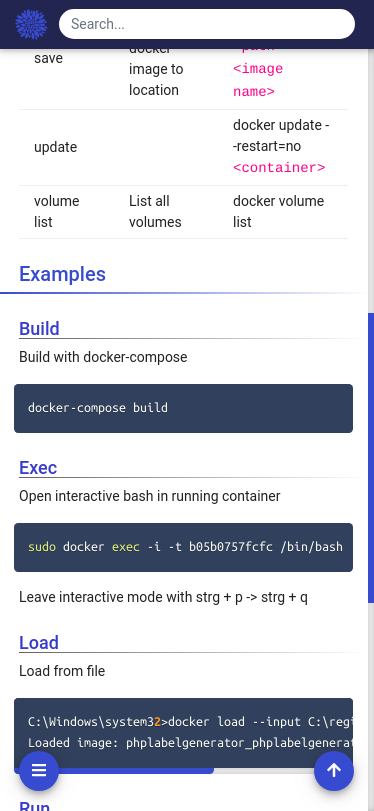

<h1 align="center">
  Wiki
</h1>

<h4 align="center">
  Modern, lightweight and powerful wiki app built on Node.js, Angular, Git and Markdown
</h4>

  

## Description
Documents are stored in a mongodb for fast access and queries. Additional for each document a markdown file is created and stored in the `repo` directory. For this directory the administrator can initiliaize a git backup. That pushs all the files to the configured git repository for backup.  

Visit the [contributing guidelines](https://github.com/perryrh0dan/wiki/blob/master/contributing.md) to learn more on how to help developing this project.

## Highlights

- Markdown editor
- User and role management
- Advanced search
- Darkmode
- Tag functionality
- Favorites functionality
- Code highlighting 
- File and Image upload
- Git backup
- Responsive Design for mobile phones

## Contents

- [Description](#description)
- [Highlights](#highlights)
- [Contents](#contents)
- [Install](#install)
- [Usage](#usage)
- [Configuration](#configuration)
- [Images](#images)

## Install

### Docker-Compose
1. Download [docker-compose.yaml](https://github.com/perryrh0dan/wiki/blob/master/docker-compose.yaml)
2. Download [sample.config.yml](https://github.com/perryrh0dan/wiki/blob/master/sample.config.yml)
3. Rename `sample.config.yml` to `config.yml` and adjust to your needs
4. Run `docker-compose up`

You may run into some problems because the mongodb and the elasticsearch cluster took too long to start and the wiki-server can't connect. To resolve this issue, run the following two commands to start: `docker-compose up wiki-es01 wiki-es02 wiki-mongodb` `docker-compose up wiki-app wiki-server`

## Usage
During the initial setup the default user `admin@admin.com` with the password `admin123` will be created.

## Configuration

### Server
The backend application can be configured with the config.yml file that is mounted into the docker image. 

### In Detail

#### frontend
- Type `string
- necessary

Url of wiki-app. Used to setup CORS and to created linked pages.

#### backend
- Type `string`
- necessary

Url of wiki-server.

#### port
- Type `number`
- necessary

Port wiki-server should listen on

#### db
- Type `string`
- necessary

Database connection string

#### search
- Type `string`
- Default ``
- optional

Elasticsearch connection string. Search will be disabled if empty

#### paths/repo
- Type `string`
- necessary

Path to the repo directory where all documents, file and images are stored

#### paths/data
- Type `string`
- necessary

Path to the data directory where all the thumbnails, tempfolders and cache is located.

#### uploads/maxImageFileSize
- Type `number`
- Default `3`
- Unit `mb`
- optional

#### uploads/maxOtherFileSize
- Type `number`
- Default `100`
- Unit `mb`
- optional

#### auth/defaultAdminEmail
- Type `string`
- Default `admin@admin.com`
- optional

#### auth/sessionSecret
- Type `string`
- necessary

Random string that is used as the session secret.

#### git/url
- Type `string`
- necessary

#### git/branch
- Type `string`
- Default `master`
- optional

#### git/auth

#### git/auth/type
- Type `enum`
- Default `basic`
- Values `auth, `ssh`
- optional

#### git/auth/username
- Type `string`
- necessary

#### git/auth/password
- Type `string`
- necessary

#### git/auth/privatekey
- Type `string`
- optional

Path to Private Key for auth type ssh

#### git/auth/sslVerify
- Type `boolean`
- Default `true`
- optional

### App

## Images

### Darkmode

  

### Markdown Editor

  

### Search

  

### User management

  

### Mobile view

  

