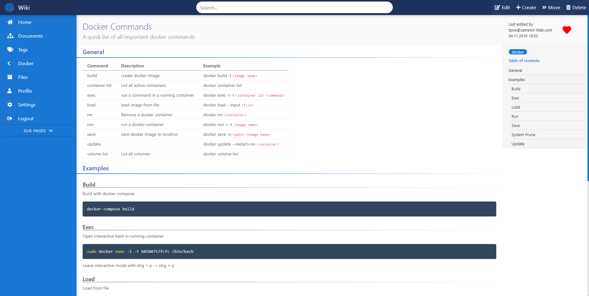
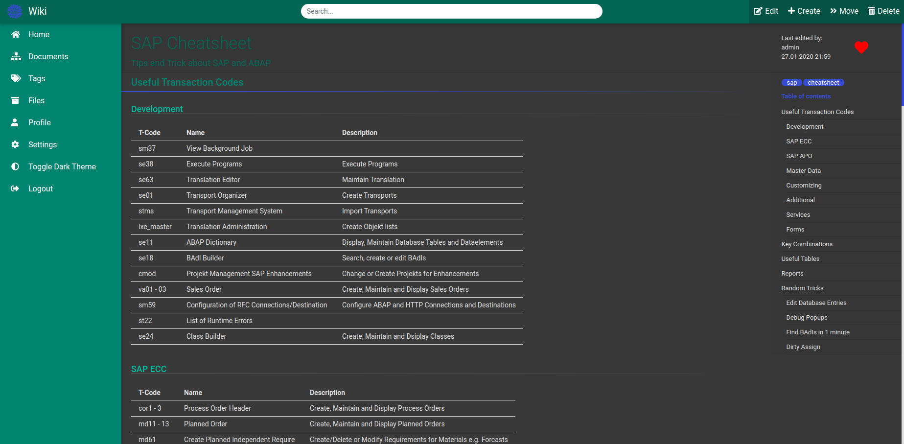
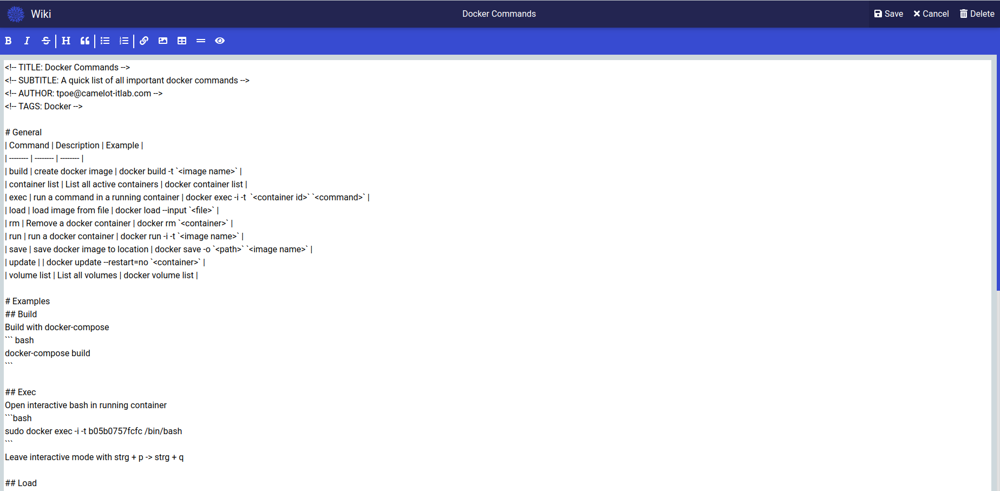
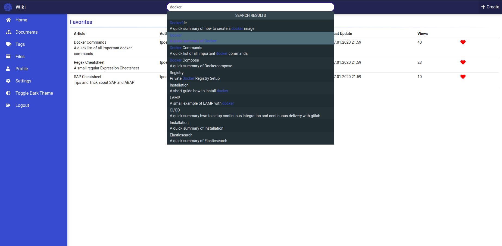
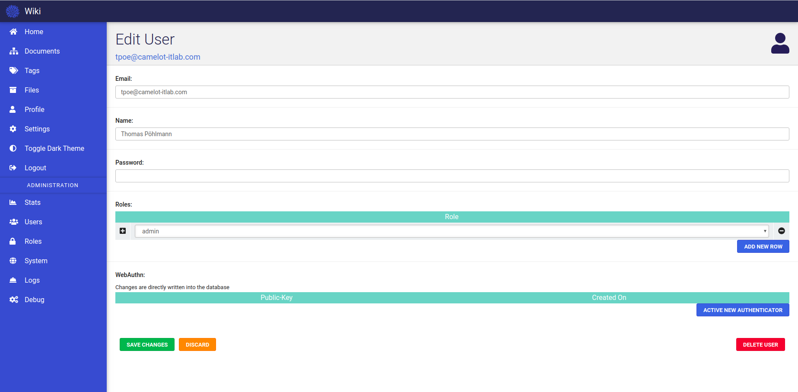

<h1 align="center">
  Wiki
</h1>

<h4 align="center">
  Modern, lightweight and powerful wiki app built with Angular and Node.js
</h4>

  

## Description

## Highlights

- Markdown editor
- User and role management
- Advanced search
- Darkmode

## Contents

- [Description](#description)
- [Highlights](#highlights)
- [Contents](#contents)
- [Install](#install)
- [Usage](#usage)
- [Configuration](#configuration)

## Install

### Docker-Compose
1. Download [docker-compose.yaml](https://github.com/perryrh0dan/wiki/blob/master/docker-compose.yaml)
2. Download [sample.config.yml](https://github.com/perryrh0dan/wiki/blob/master/sample.config.yml)
3. Rename `sample.config.yml` to `config.yml` and adjust to your needs
4. Run `docker-compose up`

## Usage
During the initial setup the default user `admin@admin.com` with the password `admin123` will be created.

## Configuration

### Server

### App

## Images

  

  

  

  

